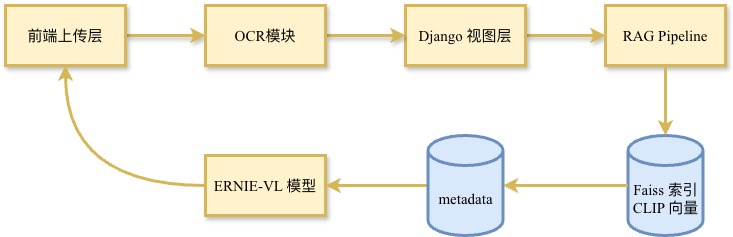
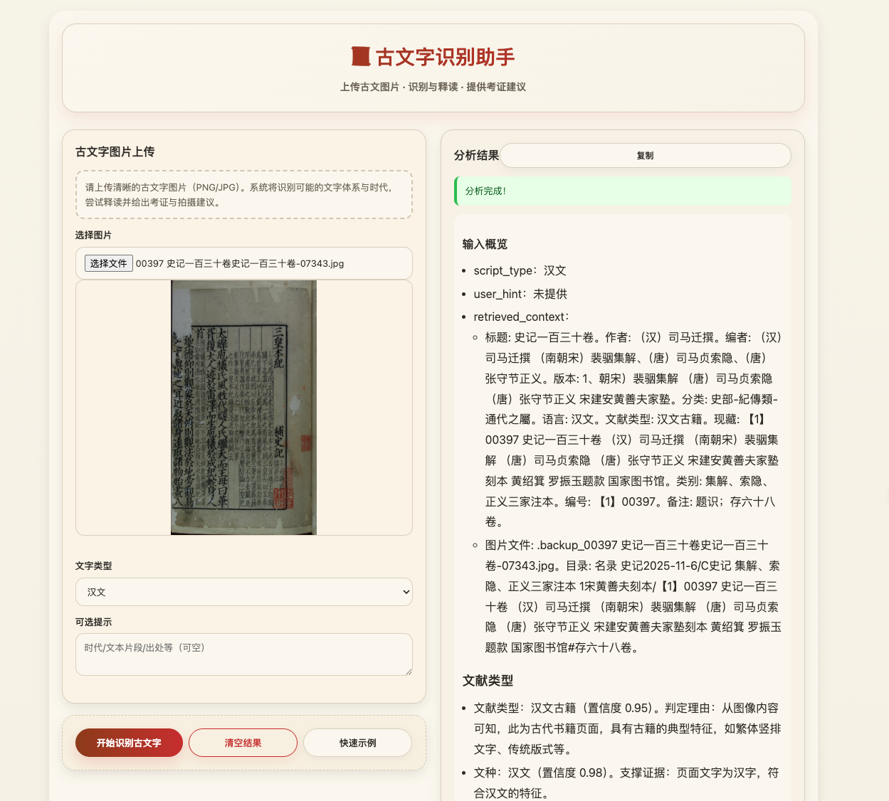

> *“把历史文献里的细小纹理交给机器看见，把识别到的故事交还给人。”*

# 古文字识别助手

跨越千年的手稿，需要一个足够细腻的数字伙伴。这个项目基于 Django、LLM 与检索增强生成（RAG），让甲骨文、敦煌文书、金石拓片都能在浏览器中获得即时的释读和结构化报告；同时，将这些结果沉淀为可检索、可聚类的样本库，为版本研究、破损评估和修复决策提供技术支撑。

---

## 目录
- [古文字识别助手](#古文字识别助手)
  - [目录](#目录)
  - [功能亮点](#功能亮点)
  - [系统架构](#系统架构)
  - [运行样例](#运行样例)
  - [快速上手](#快速上手)
  - [环境变量](#环境变量)
  - [运行与调试](#运行与调试)
  - [API 速览](#api-速览)
  - [OCR 与版式识别子模块](#ocr-与版式识别子模块)
    - [模块构成](#模块构成)
    - [快速使用（命令行）](#快速使用命令行)
    - [在项目中的位置](#在项目中的位置)
  - [RAG 工作流](#rag-工作流)
  - [项目结构](#项目结构)
  - [常见问题](#常见问题)
  - [路线图](#路线图)
  - [许可证](#许可证)

---

## 功能亮点

| 功能 | 描述 |
| --- | --- |
| 多模态识别 | 上传 PNG/JPG 即刻触发 ERNIE-4.5-Turbo-VL，返回结构化 Markdown 或 JSON 报告。 |
| 提示增强 | 支持年代、出处等自定义提示词，指导模型聚焦正确语境。 |
| 历史留痕 | 自动记录分析历史，方便专家复盘与比对。 |
| 宣纸风界面 | 原生模板提供素雅的水墨 UI，适合展陈或教学场景。 |
| RAG 加持 | Chinese-CLIP 向量、轻量 numpy 检索与 Prompt 拼装，让大模型“带引用”地做版本判定、释读与修复建议。 |

---

## 系统架构



关键模块：
- **app/views.py**：HTTP 入口、文件解析、结果持久化。
- **rag/embeddings.py**：惰性加载 Chinese-CLIP，统一生成 512 维向量。
- **rag/retriever.py**：直接读取 `embeddings.npy` + `ids.json`，完成相似度检索与过滤。
- **rag/prompt.py**：根据检索上下文构造 Markdown 或 JSON Prompt。
- **rag/pipeline.py**：将检索、提示、LLM 调用串联，返回引用、得分、上下文片段等完整产物。

---

## 运行样例



> 输入概览
>
>
> script_type：汉文
>
>
> user_hint：未提供
>
>
> retrieved_context：
>
> - 标题: 史记一百三十卷。作者: （汉）司马迁撰。编者: （汉）司马迁撰 （南朝宋）裴骃集解、（唐）司马贞索隐、（唐）张守节正义。版本: 1、朝宋）裴骃集解 （唐）司马贞索隐 （唐）张守节正义 宋建安黄善夫家塾。分类: 史部-紀傳類-通代之屬。语言: 汉文。文献类型: 汉文古籍。现藏: 【1】00397 史记一百三十卷 （汉）司马迁撰 （南朝宋）裴骃集解 （唐）司马贞索隐 （唐）张守节正义 宋建安黄善夫家塾刻本 黄绍箕 罗振玉题款 国家图书馆。类别: 集解、索隐、正义三家注本。编号: 【1】00397。备注: 题识；存六十八卷。
> - 图片文件: .backup_00397 史记一百三十卷史记一百三十卷-07343.jpg。目录: 名录 史记2025-11-6/C史记 集解、索隐、正义三家注本 1宋黄善夫刻本/【1】00397 史记一百三十卷 （汉）司马迁撰 （南朝宋）裴骃集解 （唐）司马贞索隐 （唐）张守节正义 宋建安黄善夫家塾刻本 黄绍箕 罗振玉题款 国家图书馆#存六十八卷。
>
>
> 文献类型
>
>
> 文献类型：汉文古籍（置信度 0.95）。判定理由：从图像内容可知，此为古代书籍页面，具有古籍的典型特征，如繁体竖排文字、传统版式等。
>
>
> 文种：汉文（置信度 0.98）。支撑证据：页面文字为汉字，符合汉文的特征。
>
>
> 分类：史部 - 紀傳類 - 通代之屬（置信度 0.92）。依据图像中《三皇本纪》的内容，结合retrieved_context中关于《史记》的分类信息，该书属于史部纪传类通代之属。
>
> 
>
> 本书信息
>
>
> 本书信息：《史记》一百三十卷，（汉）司马迁撰，（南朝宋）裴骃集解、（唐）司马贞索隐、（唐）张守节正义，宋建安黄善夫家塾刻本，现藏国家图书馆。
>
>
> 本书关键词：
>
> - 《史记》（置信度 0.98）
> - 司马迁（置信度 0.98）
> - 裴骃集解（置信度 0.95）
> - 司马贞索隐（置信度 0.95）
> - 张守节正义（置信度 0.95）
>
> 本页释文：
>
> - 小司马氏云：太史公作《史记》……古今君臣宜应上自开辟，下迄当代，以为一家之首尾。
> - 今阙三皇而以五帝为首者，正以大戴礼有五帝德篇，又帝丗皆叙自黄帝。
> - 帝已下，故因以五帝本纪为首。其实三皇已还载籍，罕备然君臣之始，教化之先，既论古史，不合全阙近。
> - 代皇甫谧作帝王代纪，徐整作三五曆，皆论三皇已来事，斯亦近古之一证，今并採而集之作《三皇本纪》。
> - 虽复浅近，聊补阙云。
> - 太皞庖牺氏，风姓，代燧人氏继天而王。母曰华胥，履大人迹于雷泽，而生庖牺于成纪。蛇身人首。
> - 按伏犠风姓，出国语。其华胥已下，出帝王丗纪。然雷泽，泽名，按天水有成纪县。
> - 圣德仰则观象于天，俯则观法于地，旁观鸟兽之文，与地之宜，近取诸身，远取诸物，始画八卦。
>
> 本页概要：本页内容为《三皇本纪》的开篇部分，主要阐述了司马贞补作《三皇本纪》的原因，并介绍了太皞庖牺氏的出身及相关事迹。（置信度 0.92）
>
>
> 文言文翻译：小司马氏说：太史公作《史记》，古今君臣的事迹应该上自开天辟地，下至当代，作为一家的首尾。如今缺少三皇而以五帝为首，正是因为《大戴礼记》有《五帝德》篇，并且帝王世系都从黄帝开始叙述。黄帝以后的事迹，所以用《五帝本纪》作为开头。其实三皇以来的记载，书籍很少完备，然而君臣的开始，教化的先河，既然论述古代历史，不应该全部缺失。近代皇甫谧作《帝王代纪》，徐整作《三五曆》，都论述三皇以来的事情，这也是接近古代的一个证据，如今一并采集而写成《三皇本纪》。虽然浅显粗略，暂且补上这个缺漏。太皞庖牺氏，风姓，继承燧人氏而称王。母亲叫华胥，在雷泽踩了大人的脚印，在成纪生下庖牺。蛇身人首。根据《国语》，伏犠风姓。华胥以下的内容出自《帝王世纪》。然而雷泽是泽名，按天水有成纪县。他仰则观察天象，俯则观察地理，旁观鸟兽的花纹和地理的适宜之处，近取象于自身，远取象于万物，开始画八卦。
>
>
> 本页关键词：《三皇本纪》、太皞庖牺氏、司马贞、补作原因、八卦起源
>
> 
>
> 题名与著者
>
>
> 题名：《三皇本纪》，属《史记》补作内容（置信度 0.95）。
>
>
> 本书概要：《史记》是中国第一部纪传体通史，记载了从上古传说中的黄帝时代，到汉武帝太初四年间共三千多年的历史。司马迁以其“究天人之际，通古今之变，成一家之言”的史识，使《史记》成为中国史学和文学的经典之作。裴骃的集解、司马贞的索隐和张守节的正义，对《史记》进行了注释和阐发，有助于读者更好地理解《史记》的内容。参考：retrieved_context中关于《史记》的介绍。
>
>
> 著者：撰者司马迁，补作者司马贞，集解者裴骃，索隐者司马贞，正义者张守节。
>
>
> 著者小传：
>
> - 司马迁：西汉史学家、文学家、思想家。元封三年（前108年）任太史令，继承父业，著述历史。后因替李陵败降之事辩解而受宫刑，调任中书令，发愤继续撰写《史记》。（置信度 0.98）
> - 司马贞：唐代史学家，开元初年官至朝散大夫，后升任太子左庶子，曾为《史记》作索隐。（置信度 0.95）
>
>
> 版本与出版信息
>
>
> 版本：南宋建安黄善夫家塾刻本（置信度 0.92）。判定理由：retrieved_context中明确提及“宋建安黄善夫家塾刻本”。
>
>
> 相似版本建议：
>
> - 明嘉靖、万历年间南北监刻《二十一史》本，此本为官刻本，在版本校勘、字体等方面与宋建安黄善夫家塾刻本可能存在差异（置信度 0.85）。
> - 清乾隆年间武英殿刻《二十四史》本，该本经过清代校勘整理，与宋本在内容和版式上会有所不同（置信度 0.88）。
>
> 版本判定要点：从版式风格看，宋建安刻本具有建刻本的典型特征，字体方正严谨，笔画刚劲；纸张方面，宋刻本多用皮纸或竹纸，质地坚韧。此本版式、字体等符合宋建安刻本的特征。
>
>
> 出版者：宋建安黄善夫家塾。
>
>
> 出版者小传：黄善夫是南宋建安地区的书坊主人，以刻书闻名，其家塾刻本以校勘精良、刻印精美著称。（置信度 0.85）
>
> 
>
> 版式与外观
>
>
> 版式：因仅提供一页图像，难以准确判断整体版式，从本页看，大致为每行约20字左右，小字双行未显示，白口，左右双边（推测，置信度 0.7）。
>
>
> 牌記：本页未显示牌记内容（置信度 0.0）。
>
>
> 题跋：本页未显示题跋内容（置信度 0.0）。
>
>
> 钤印：本页未显示钤印内容（置信度 0.0）。
>
>
> 数量：原书一百三十卷，现藏六十八卷（置信度 0.95，依据retrieved_context）。
>
>
> 装幀形式：线装（推测，因宋本多为线装，置信度 0.8）。
>
>
> 开本尺寸（cm）：因仅一页图像，无法准确估算，暂未识别（置信度 0.0）。
>
>
> 板框尺寸（cm）：同上，暂未识别（置信度 0.0）。
>
> 
>
> 文献内容分析
>
>
> 关键字形/词汇候选：
>
> - “庖牺氏”：即伏羲氏，释义依据常见古代文献知识，置信度 0.98。
> - “雷泽”：古泽名，在今山西永济南或山东菏泽东北等说法，此处依据文本推测为相关地理概念，置信度 0.85。
>
> 语义与主题分析：本页文本主要围绕司马贞补作《三皇本纪》的原因展开，阐述了对三皇记载缺失的看法，并开始介绍太皞庖牺氏的相关事迹，主题是对古代历史的补充记载。
>
>
> 现代研究价值：可服务于中国古代史研究、史学史研究、古代文献学研究等课程，对于公众了解古代历史和文化也有一定帮助。
>
> 
>
> 命名实体识别
>
> |类别|原文片段|释义或背景|置信度|
> | ---- | ---- | ---- | ---- |
> |人名|司马迁|西汉史学家，撰写《史记》|0.98|
> |人名|裴骃|南朝宋史学家，为《史记》作集解|0.95|
> |人名|司马贞|唐代史学家，为《史记》作索隐并补作《三皇本纪》|0.95|
> |人名|张守节|唐代学者，为《史记》作正义|0.95|
> |地名|雷泽|古泽名|0.85|
> |地名|成纪|古县名|0.85|
>
>
> 收藏与传承
>
>
> 现藏单位：国家图书馆，位于中国北京（置信度 0.98）。
>
>
> 收藏历史：从retrieved_context可知，该书有黄绍箕、罗振玉题款，说明在流传过程中经他们之手，具体流传节点因信息有限暂未详细识别（置信度 0.7）。
>
>
> 收藏机构/收藏家介绍：国家图书馆是国家总书库，全面收藏国内出版物，是世界上最大的中文文献收藏中心之一，在古籍收藏和保护方面具有重要地位。（置信度 0.98）
>
>
> 书目著录：在相关古籍书目中应有记载，具体条目号因未检索到详细信息暂未识别（置信度 0.0）。
>
> 
>
> 影像与研究资源
>
>
> 全文影像：可在中国国家图书馆官网等数据库查询相关影像资源（若有），目前无直接链接。
>
>
> 影印信息：有相关影印本出版，如中华书局点校本《史记》等，但非此宋本影印（置信度 0.85）。
>
>
> 研究论著：
>
> - 《史记研究集成·十二本纪·三皇本纪》，对《三皇本纪》有深入研究，出自相关学术著作。
> - 《史记会注考证》，日本泷川资言著，对《史记》及三家注有详细考证，涉及《三皇本纪》相关研究。
>
> 学习资料推荐：中国国家图书馆官网的古籍资源板块、中国知网的古代文献研究论文等。
>
> 
>
> 破损与修复建议
>
>
> 破损情况：从图像看，页面有部分破损、污渍，但破损面积未超过书叶的20%，判定为轻度破损（置信度 0.85）。
>
>
> 修复建议：对破损处进行纸张加固，可采用局部修补的方法；对污渍进行适当清洁处理；进行数字化采集，以保存古籍信息；控制保存环境，保持适宜的温度、湿度和光照条件。
>
>
> 破损信息判定说明：依据破损面积未超过书叶20%的标准判定为轻度破损。
>
> 
>
> 展示与活化建议
>
>
> 展签介绍：《三皇本纪》页，出自南宋建安黄善夫家塾刻本《史记》，司马贞补作，介绍了太皞庖牺氏的出身及相关事迹，现藏于国家图书馆。
>
>
> 活化建议：开展线上古籍展览，展示该页高清影像及相关解读；制作相关文创产品，如书签、笔记本等，印上《三皇本纪》的经典语句；举办古籍文化讲座，介绍《史记》及三家注的相关知识。
>
> 
>
> 小结
>
>
> 可能的时代为南宋，书写体系为繁体汉字竖排排版，具有宋刻本的典型特征（置信度 0.92）。
>
>
> 本次使用到的参考条目：retrieved_context中的标题、作者、版本、现藏等信息。
>
>
> 免责声明：识别仅供参考，请参考专业文献与学术研究结论。
>

## 快速上手

```bash
# 1. 克隆项目
git clone --recursive https://github.com/Jafekin/font.git font && cd font

# 2. 创建虚拟环境（推荐同目录，不覆盖系统 Python）
python3 -m venv .venv
source .venv/bin/activate  # Windows 使用 .venv\Scripts\activate

# 3. 安装依赖
pip install -r requirements.txt

# 4. 初始化数据库
.venv/bin/python manage.py migrate

# 5.（可选）创建管理员
.venv/bin/python manage.py createsuperuser

# 6. 启动开发服务器
.venv/bin/python manage.py runserver 0.0.0.0:8000
```

访问：
- 前台界面：http://localhost:8000
- Django Admin：http://localhost:8000/admin

---

## 环境变量

将 `.env.example` 复制为 `.env`，填入以下字段：

| 变量 | 示例值 | 说明 |
| --- | --- | --- |
| `DEBUG` | `True` | 生产务必改为 `False` |
| `SECRET_KEY` | `change-me` | 生成随机字符串，防止安全风险 |
| `OPENAI_API_KEY` | `your-baai-key` | 对接文心大模型的密钥 |
| `OPENAI_BASE_URL` | `https://aistudio.baidu.com/llm/lmapi/v3` | 可替换成私有化接入网关 |
| `ALLOWED_HOSTS` | `localhost,127.0.0.1` | 生产环境填入真实域名 |

> 生产部署记得额外设置 `CSRF_TRUSTED_ORIGINS`、`SECURE_HSTS_SECONDS` 等安全参数。

---

## 运行与调试

```bash
# 运行单元测试
.venv/bin/python -m pytest tests

# 构建 / 重建 Chinese-CLIP 索引（numpy 文件）
pip install -e thirdparty/Chinese-CLIP  # 首次需要安装子模块
.venv/bin/python scripts/build_index.py --image-dir media/uploads --index-path rag/index --image-weight 0.65

# 启动 VS Code 默认任务（server）
# Cmd+Shift+B / Ctrl+Shift+B -> Django: Run Server
```

常用管理命令：
- `python manage.py shell`：快速验证模型或 ORM。
- `python manage.py collectstatic`：部署前收集静态文件。
- `python manage.py dumpdata app.ScriptAnalysis`：导出历史分析记录备份。

---

## API 速览

| Endpoint | 方法 | 说明 |
| --- | --- | --- |
| `/` | GET | 首页上传界面 |
| `/api/analyze` | POST (multipart) | 上传图片触发分析，返回 Markdown 报告 |
| `/api/analyze-base64` | POST (JSON) | 传入 Base64 图片，适合移动端或前端截图 |
| `/api/history` | GET | 获取最近 20 条分析记录 |

示例（multipart）：

```python
import requests

with open("tests/image/22.jpg", "rb") as f:
    resp = requests.post(
        "http://localhost:8000/api/analyze",
        files={"image": f},
        data={"script_type": "甲骨文", "hint": "商晚期 卜辞"}
    )
print(resp.json())
```

---


## OCR 与版式识别子模块

在 RAG 语义分析之前，本项目提供了一个相对独立的 **版式 / 形态识别试验场**，位于 `ocr/` 目录，主要基于 PaddleOCR，对古籍影像的列数、行数、边框与版心结构进行自动分析，可作为：

- 前置结构化步骤：为后续文字识别、RAG 检索提供版面先验（如列数、白口/黑口、双行小字等）。
- 版本/破损研究辅助：通过对版式指纹的量化描述，服务版本比勘、断代和破损程度评估。

### 模块构成

- `ocr/paddle_pipeline.py`：核心逻辑。先调用 PaddleOCR 获得每一行文字的检测框，再据此聚类出列、估算行数与行高，检测边框（白口/黑口、单/双边）等。
- `ocr/pipeline.py`：默认入口，封装一个带缓存的 `PaddleLayoutPipeline`，便于在 Web/RAG 流程中多次复用。
- `ocr/cli.py`：命令行工具，可在仓库根目录直接运行版式分析并输出 JSON。
- `ocr/ocr.py`：更贴近 PaddleOCR 原生 API 的简单示例脚本，便于测试环境和参数。


### 快速使用（命令行）

```bash
# 在仓库根目录，识别单张古籍图片的版式
python ocr/cli.py data/史记_1_100393_0065_b2425e.jpg

# 指定 PaddleOCR 语言或启用 GPU
python ocr/cli.py data/史记_1_100393_0065_b2425e.jpg \
  --paddle-lang chinese_cht \
  --paddle-gpu
```

命令行输出为 JSON，主要字段包括：

- `num_columns` / `lines_per_column`：列数与各列行数，用于判断单栏 / 双栏以及版心高度。
- `chars_per_line_median`：基于 OCR 文本长度估算的行均字数（中位数），可作为版本比勘的版式特征之一。
- `border_color`、`borders`：判断页面为白口或黑口，并识别四周单/双边框数量，辅助刻工与版式风格分析。
- `small_font`、`double_small_lines`：利用行高与行间距，给出小字、双行注释等布局的启发式判断。
- `columns_detail`：逐列给出原始识别文本与检测框坐标，可用于可视化叠加或进一步聚类分析。

### 在项目中的位置

- **面向研究场景**：`ocr/` 输出的版式特征可以与 RAG 层的语义分析结果（作者、版本、内容主题等）结合，构成更完整的“古籍版本指纹”。
- **面向工程集成**：如果你已有独立的古籍 OCR 流水线，也可以单独调用 `ocr/paddle_pipeline.py` 或 `ocr/pipeline.py`，只使用布局分析能力，将结果写回你的数据库或检索系统。

后续计划会在此基础上，进一步扩展对 **破损区域检测、钤印区域定位、著录字段抽取** 等任务的支持，使其更好地服务古籍普查与修复场景。

## RAG 工作流

本项目的 RAG（Retrieval-Augmented Generation）部分，用来把“看见的一页图像”放回完整文献语境中：先在本地向量索引里找到相似页面及其题名、版本、馆藏等元数据，再把这些上下文与当前 OCR 结果一起交给大模型，让生成的结论始终“带引用、有依据”，适合做版本判定、著录补全和修复建议等需要可追溯证据的任务。

1. **嵌入**：`scripts/build_index.py` 遍历 `media/uploads`，调用 `rag/embeddings.py` 生成图文向量，并保存 `embeddings.npy`、`ids.json`、`metadata.json`。
2. **检索**：`rag/retriever.py` 直接加载这些 numpy/JSON 文件完成 Top-K 搜索，不再依赖 txtai/Faiss。
3. **提示词**：`rag/prompt.py` 将检索到的上下文拼入高级 Prompt，可切换 Markdown / JSON 模板。
4. **生成**：`rag/pipeline.py` 调用 `analyze_ancient_script`，输出分析正文、引用列表、分数、上下文片段数量等。

快速调用：

```python
from rag.pipeline import RAGPipeline

pipeline = RAGPipeline(index_path="rag/index")
result = pipeline.run(
    image_path="media/uploads/2025/11/05/example.png",
    script_type="甲骨文",
    hint="王卜辞"
)
print(result["analysis"])
print(result["num_references"], result["retrieved_references"])
```

---

## 项目结构

```
font/
├── app/                 # Django 主应用（模型、视图、模板）
├── config/              # 全局设置、路由、WSGI 入口
├── rag/                 # 向量、检索、Prompt、Pipeline
├── scripts/             # 数据与索引构建脚本
├── media/uploads/       # 用户上传图片
├── tests/               # Pytest 测试与示例图片
├── requirements.txt     # 依赖列表
└── README.md            # 项目前言
```

---

## 常见问题

**Q: 首次运行报错 `OpenAI library is not installed`？**  
A: 重新执行 `pip install -r requirements.txt`，或确认虚拟环境已激活。

**Q: 上传图片后报 500，提示 `analysis failed`？**  
A: 检查 `.env` 中的密钥与 Base URL 是否可访问；必要时在 `app/views.py` 中打开日志。

**Q: Faiss 索引过大或内存不足？**  
A: 调整 `scripts/build_index.py` 的分桶策略，或考虑使用 Milvus/Weaviate 这样的向量数据库。

---

## 路线图

- [ ] JSON-LD 标注管线（断裂等级、修复建议、版本指纹）。
- [ ] 向量索引增量更新与自动重建。
- [ ] RAG 结果缓存与引用可视化。
- [ ] Celery 异步任务，将批量识别与索引构建解耦。
- [ ] 多语言界面与 API 结果翻译。

---

## 许可证

MIT License © Jafekin, Dalian University of Technology

欢迎通过 Issue / PR 分享你的发现、想法或下一步需求。
