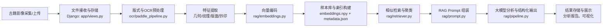
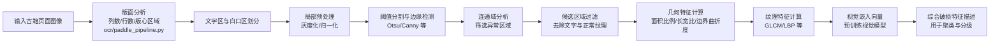
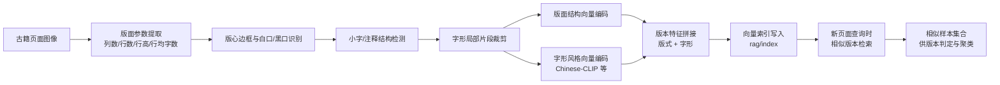
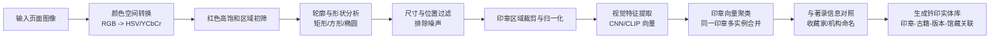
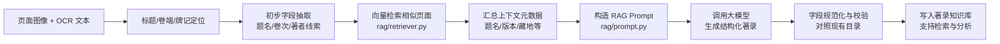

# 古文字识别助手：关键流程示意

> 说明：本文件使用 Mermaid 流程图描述项目中的若干关键步骤，可在 VS Code / GitHub / mermaid.live 中预览或导出为 PNG/SVG，用于论文或报告配图。

---

## 1. 古籍影像总体处理流程

---

## 2. 特征提取与破损候选区域检测流程

---

## 3. 版本指纹构建与相似版本检索

---

## 4. 钤印识别与实体聚类流程

---

## 5. 著录识别与 RAG 语义增强流程

---

如需，我可以再单独为“破损分级”或“整体系统架构（前端–Django–RAG–LLM）”画一张更偏宏观的架构图，或者帮你把这些 Mermaid 渲染成 PNG 并示意如何插入到论文/报告中。